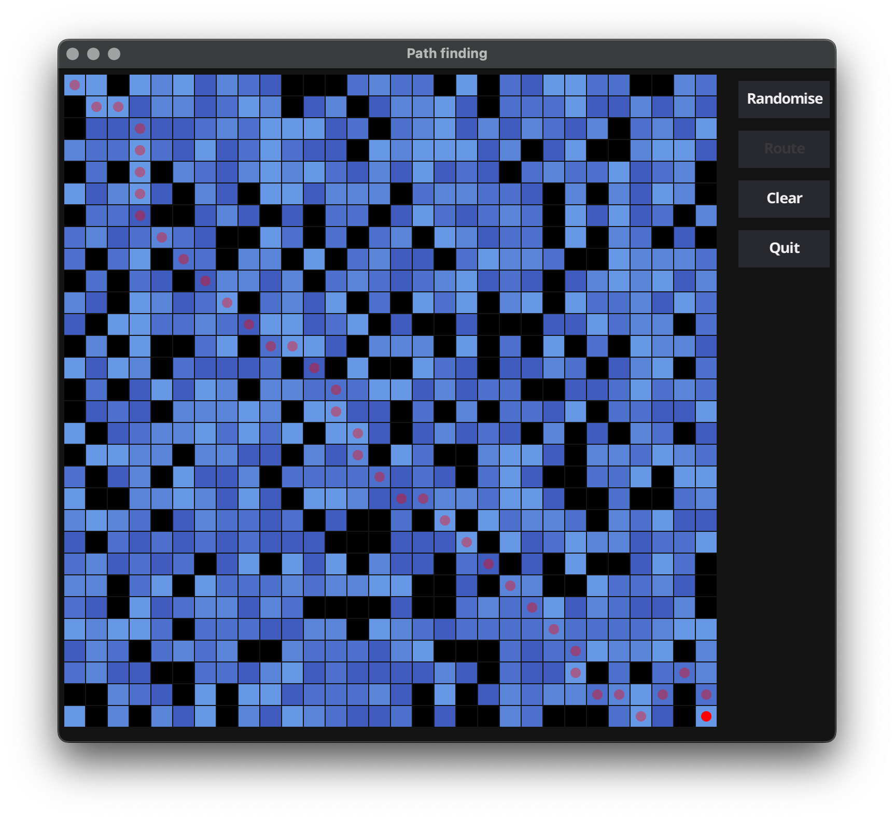

github.com/gbkr-com/astar
===

The A* path finding algorithm.

The package contains a sample application which illustrates how the algorithm
finds paths.

The landscape for path finding comprises cells with varying colours: the darker
the colour the higher the cost of passing through the cell. Use the `Randomise`
button to change the landscape: then use the `Route` button to show the path.